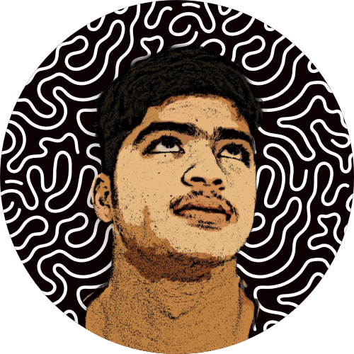

# Hey there, Shivam Pande here👋
## Full Stack Developer 🖥️, ML Enthusiast 🤖, Content Creator ▶️

  

  
  
  

- 🖥️ I’m a full-stack web developer...
- ✈️ I make video games... 
- 📺 I'm a content creator. Here is the link to my YouTube channel [@TheTechpreneurs](https://www.youtube.com/thetechpreneurs) 

  

## HAPPY CODING :)
<!--
**ShivamPande18/ShivamPande18** is a ✨ _special_ ✨ repository because its `README.md` (this file) appears on your GitHub profile.

Here are some ideas to get you started:

- 🔭 I’m currently working on ...
- 🌱 I’m currently learning ...
- 👯 I’m looking to collaborate on ...
- 🤔 I’m looking for help with ...
- 💬 Ask me about ...
- 📫 How to reach me: ...
- 😄 Pronouns: ...
- ⚡ Fun fact: ...
-->
